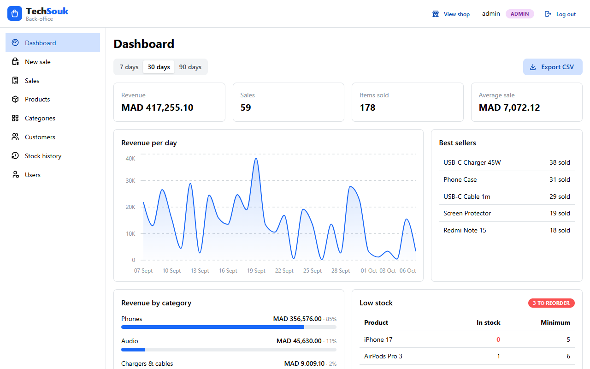
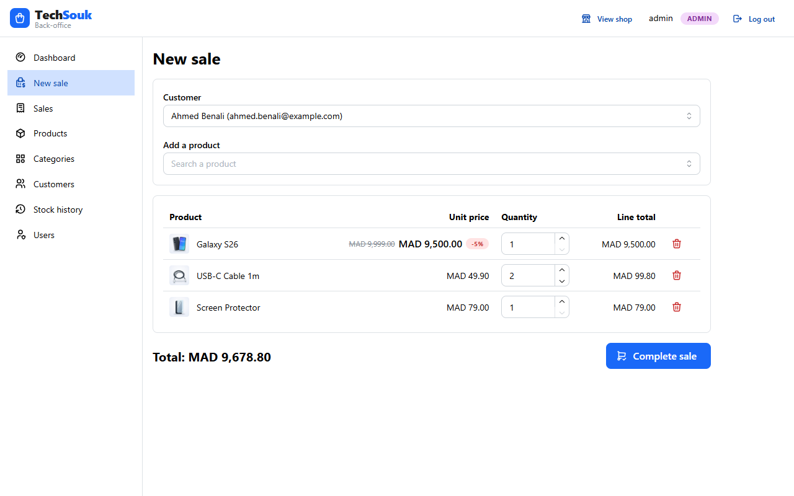
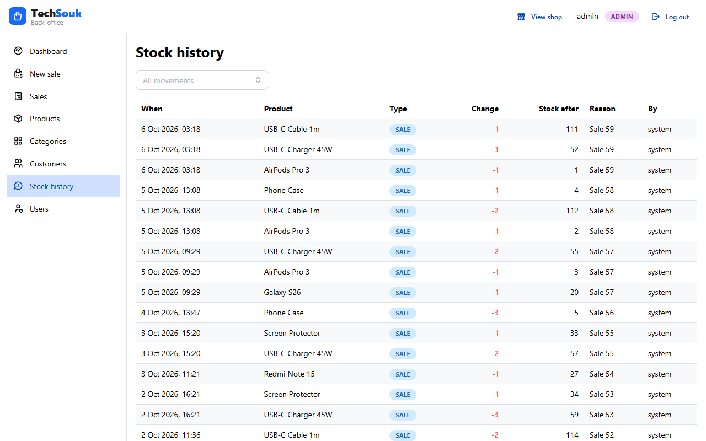
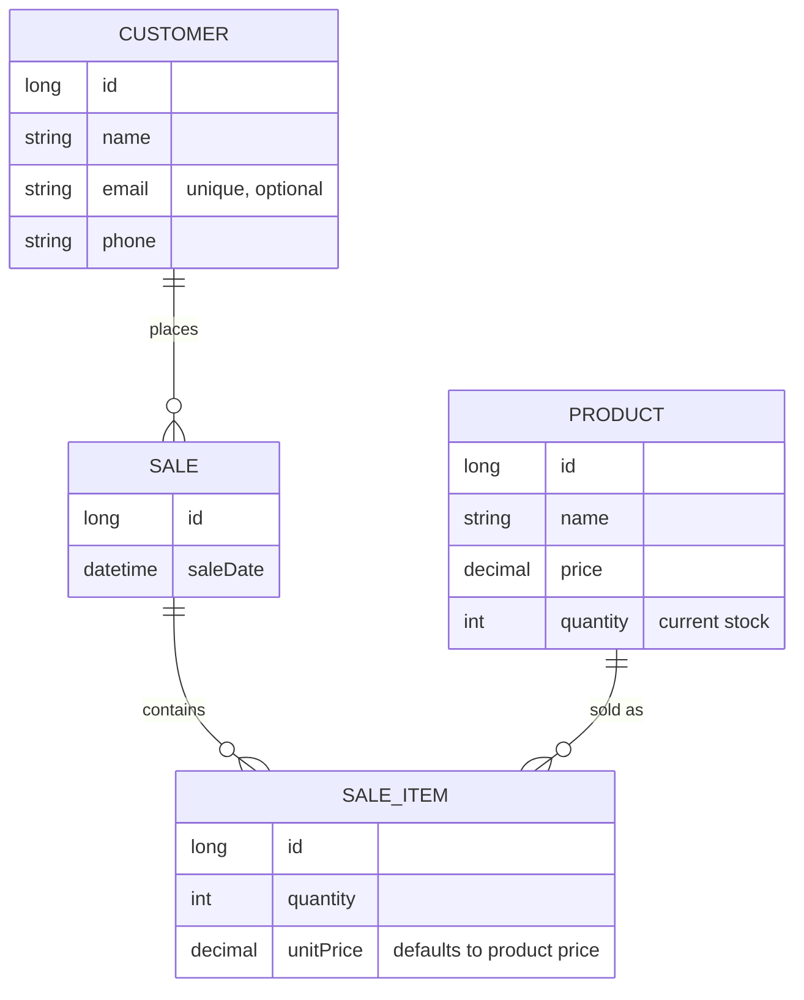

# Stock API

[](https://github.com/IlyasRachid20/stock-api/actions/workflows/ci.yml)


A REST API and web dashboard for small shops to manage **customers, products, sales and stock**.
Every sale updates the stock automatically, overselling is impossible, and every
error comes back with a clear message.



| New sale | Stock history |
|---|---|
|  |  |

## What I built, and why

A small shop needs to know three things at any moment: **what is in stock, what was sold, and why the numbers are what they are.** Spreadsheets get these wrong as soon as two people sell at the same time.

This project is a complete, production-style answer to that problem:

- **A Java / Spring Boot API** that keeps stock correct under concurrent sales (row locking, one transaction per sale), records every stock change with who made it and when, and exposes clear reports.
- **A React dashboard** that a cashier can use all day (new sale in a few clicks, live total, stock and customer search) and that gives the owner the numbers: revenue per day, best sellers, low stock, CSV export.
- **Security built in:** JWT login, hashed passwords, and roles that decide what each person can see and do (cashiers never see revenue).
- **Built to be maintained:** versioned database migrations, a clean API contract, consistent errors, Docker, and **188 automated tests** on every change (the backend ones on H2 and on a real PostgreSQL).

Every feature was added through a reviewed pull request with its tests, and bugs found along the way (lost stock updates, N+1 queries, time-zone errors) are covered by tests so they can't come back.

## Highlights

- **Secure by default:** every endpoint needs a JWT from `POST /api/auth/login`; passwords are stored as BCrypt hashes; `ADMIN` and `CASHIER` roles.
- **Full stock history:** every change (initial stock, restock, correction, sale, cancelled sale) is recorded with the quantity before and after, who made it and when. When stock doesn't add up, the history shows why.
- **Low-stock alerts:** each product has a minimum level; `GET /api/products/low-stock` lists what needs reordering, emptiest first.
- **Sales reports (admin):** totals, day-by-day sales with no gaps (ready for charts), best sellers and a CSV export, counted in the shop's own time zone.
- **Stock always in sync:** selling an item takes it out of stock; deleting an item or a whole sale puts it back.
- **No overselling, even under load:** the product row is locked while its stock changes (by a sale or a product update), so two requests at the same moment can't both take the last unit or overwrite each other's stock.
- **Fast lists:** related rows are loaded in batches, so a page of sales takes at most 5 queries instead of one per sale, item and product (41 before). A test fails if this regresses.
- **Standard HTTP semantics:** `201 Created` on create, `204 No Content` on delete.
- **Clear, consistent errors:** every error has the same JSON shape, including malformed JSON, wrong types, unknown URLs and wrong methods: `400` with a message per invalid field, `404` for unknown ids, `409` for business conflicts (not enough stock, email already used), and a generic `500` that never leaks internals.
- **Sales with totals:** each sale returns its items, line totals and a computed total. Sale dates are UTC instants (`...Z`), so clients in any time zone show the right local time.
- **Versioned database schema:** tables are created by Flyway migration scripts; Hibernate only validates them at startup and never changes the database.
- **Pagination, search and sorting** on every list, with a hard cap of 100 items per page.
- **Clean API contract:** requests and responses are dedicated DTOs (Java records), separate from the database entities, so internal fields never leak and the database can change without breaking clients.
- **Interactive documentation:** Swagger UI lists every endpoint and lets you try it from the browser.
- **160 backend tests and 28 frontend tests** run on every pull request with GitHub Actions, on H2 **and on a real PostgreSQL**.

## Tech stack

| Layer | Technology |
|---|---|
| Language | Java 21 |
| Framework | Spring Boot 4.1 (Web MVC, Data JPA, Validation) |
| Database | PostgreSQL, schema managed by Flyway (H2 in-memory for fast tests) |
| API docs | springdoc-openapi 3 / Swagger UI |
| Tests | JUnit 5, MockMvc, AssertJ |
| CI | GitHub Actions: tests on H2 and PostgreSQL, plus a Docker Compose smoke test |
| Packaging | Docker multi-stage image (non-root), Docker Compose |
| Security | Spring Security 7, JWT (HS256) via the OAuth2 resource server, BCrypt |
| Build | Maven (wrapper included) |
| Web dashboard | React 19, TypeScript, Vite, Mantine (UI and charts), TanStack Query, React Router |

## Data model



## API overview

| Resource | Endpoints |
|---|---|
| Customers | `GET/POST /api/customers` · `GET/PUT/DELETE /api/customers/{id}` |
| Products | `GET/POST /api/products` · `GET/PUT/DELETE /api/products/{id}` · `GET /api/products/low-stock` · `POST /api/products/{id}/restock` · `POST /api/products/{id}/adjustments` |
| Stock history | `GET /api/stock-movements?productId=&type=` (newest first) |
| Reports (`ADMIN` only) | `GET /api/reports/summary` · `GET /api/reports/sales-by-day` · `GET /api/reports/top-products` · `GET /api/reports/sales.csv` (all take `from`/`to`, default the last 30 days) |
| Sales | `GET/POST /api/sales` · `GET/DELETE /api/sales/{id}` |
| Sale items | `GET/POST /api/sale-items` · `GET/DELETE /api/sale-items/{id}` |
| Auth | `POST /api/auth/login` (public) · `GET /api/auth/me` |
| Users (`ADMIN` only) | `GET/POST /api/users` · `DELETE /api/users/{id}` |

Full details, request bodies and a **Try it out** button: http://localhost:8080/swagger-ui.html

### Authentication

```http
POST /api/auth/login
{"username": "admin", "password": "..."}
```
```json
{"accessToken": "eyJhbGciOiJIUzI1NiJ9...", "tokenType": "Bearer", "expiresIn": 28800}
```

Send the token on every other request as `Authorization: Bearer <accessToken>`. In Swagger UI, click **Authorize** and paste it. Without a valid token the API answers `401`; with a role that isn't allowed, `403`. The login endpoint ignores any token sent with it, so an expired token (for example one Swagger UI still remembers) never blocks logging in again.

On first start, when there are no users, an `admin` account is created with the password from `APP_ADMIN_PASSWORD`, or a generated one printed once in the logs. The admin then creates the other accounts with `POST /api/users`.

| Setting | Purpose |
|---|---|
| `APP_JWT_SECRET` | Signs the tokens, at least 32 bytes. If unset, a random key is used and tokens stop working after a restart (development only). |
| `APP_ADMIN_PASSWORD` | Password of the first `admin` account. |
| `APP_TIME_ZONE` | Shop time zone for reports, e.g. `Africa/Casablanca` (default `UTC`). |

### Roles

| | `ADMIN` | `CASHIER` |
|---|---|---|
| Read products, customers, sales | yes | yes |
| Register and update customers | yes | yes |
| Create sales and add items | yes | yes |
| Create, update or delete products (prices, stock) | yes | no |
| Restock, adjust stock | yes | no |
| Read stock history and low-stock list | yes | yes |
| Sales reports and CSV export | yes | no |
| Delete customers, sales or sale items | yes | no |
| Manage user accounts | yes | no |

Anything not listed as open to cashiers is admin-only by default, including endpoints added later.

### Lists: pagination, search and sorting

Every list endpoint is paginated (20 items per page by default, at most 100) and accepts `page`, `size` and `sort`:

| Endpoint | Filter |
|---|---|
| `GET /api/products` | `search`: part of the name, case-insensitive |
| `GET /api/customers` | `search`: part of the name or email |
| `GET /api/sales` | `customerId` (newest sales first by default) |
| `GET /api/sale-items` | `saleId` |

```http
GET /api/products?search=galaxy&sort=price,desc&page=0&size=20
```
```json
{
  "content": [
    {"id": 1, "name": "Galaxy S26", "price": 9500.00, "quantity": 10}
  ],
  "page": {"size": 20, "number": 0, "totalElements": 1, "totalPages": 1}
}
```

### Example: selling a product

```http
POST /api/sales
{"customerId": 1, "items": [{"productId": 1, "quantity": 3}, {"productId": 6, "quantity": 2}]}
```

The sale and all its items are saved in **one transaction**: if any product is short of stock, nothing is saved and the API answers `409`. `unitPrice` is optional and defaults to the product's current price. Items can also be added one by one to an existing sale with `POST /api/sale-items` `{"saleId": 1, "productId": 1, "quantity": 3}`.

The product's stock goes from 10 to 7, and the sale now shows its total:

```http
GET /api/sales/1
```
```json
{
  "id": 1,
  "customer": {"id": 1, "name": "Ahmed"},
  "saleDate": "2026-09-29T17:11:37Z",
  "items": [
    {"id": 1, "saleId": 1, "product": {"id": 1, "name": "Galaxy S26"}, "quantity": 3, "unitPrice": 9500.00, "lineTotal": 28500.00}
  ],
  "total": 28500.00
}
```

### Stock history

```http
POST /api/products/1/restock        {"quantity": 20, "reason": "Delivery #42"}
POST /api/products/1/adjustments    {"quantityChange": -1, "reason": "Broken screen"}
GET  /api/stock-movements?productId=1
```
```json
{
  "content": [
    {"type": "ADJUSTMENT", "quantityChange": -1, "quantityAfter": 26, "reason": "Broken screen", "createdBy": "admin", "createdAt": "2026-09-29T22:20:00Z", ...},
    {"type": "RESTOCK", "quantityChange": 20, "quantityAfter": 27, "reason": "Delivery #42", "createdBy": "admin", ...},
    {"type": "SALE", "quantityChange": -3, "quantityAfter": 7, "reason": "Sale 12", "saleItemId": 31, "createdBy": "sara", ...}
  ],
  "page": {...}
}
```

Movement types: `INITIAL`, `RESTOCK`, `ADJUSTMENT`, `SALE`, `SALE_CANCELLED`. History rows are only ever added, never edited.

### Error responses

Every error uses one of two shapes: `{"error": "message"}`, or `{"errors": {"field": "message"}}` for invalid request bodies.

```http
POST /api/sale-items   (quantity 50, only 7 left)
409 Conflict
{"error": "Not enough stock for product 'Galaxy S26': 7 available, 50 requested"}

GET /api/products/abc
400 Bad Request
{"error": "Invalid value 'abc' for parameter 'id'"}

GET /api/products?sort=color
400 Bad Request
{"error": "Cannot sort by unknown field 'color'"}

POST /api/products     {"name": "", "price": -5}
400 Bad Request
{"errors": {"name": "must not be blank", "price": "must be greater than or equal to 0.00"}}
```

## Deploy your own (Render + Neon, free)

1. Create a PostgreSQL database on [Neon](https://neon.tech) and note its **direct** connection (not the `-pooler` one): host, database, user, password.
2. On [Render](https://render.com): **New → Blueprint**, pick this repository. [`render.yaml`](render.yaml) describes the service; Render asks for the database settings and an admin password, and generates `APP_JWT_SECRET` itself.
3. The first deploy creates the tables (Flyway), the `admin` account and, in demo mode, a sample shop with a `demo` cashier account.

The free plan sleeps after 15 minutes without traffic, so the first request after a pause can take about a minute.

## Getting started

### Option 1: Docker (recommended)

Only [Docker](https://www.docker.com/products/docker-desktop/) is needed: no Java, no PostgreSQL install.

```bash
git clone https://github.com/IlyasRachid20/stock-api.git
cd stock-api
cp .env.example .env        # then set the passwords and APP_JWT_SECRET in .env
docker compose up --build
```

Open **http://localhost:8080** for the dashboard, and http://localhost:8080/swagger-ui.html for the API documentation. The image builds the React dashboard and the API serves it from the same address, so there is nothing else to start. The database is kept in a Docker volume between restarts; `docker compose down --volumes` deletes it.

To try it with sample data (a month of sales and a `demo` cashier account with the password `demo-cashier`), set `APP_DEMO_DATA=true` and `APP_DEMO_PASSWORD=demo-cashier` in `.env` before the first start.

### Option 2: Run with Java

**Prerequisites:** JDK 21 and a running PostgreSQL database. No Maven install is needed: use `./mvnw` (or `mvnw.cmd` on Windows).

1. Clone the repository:
   ```bash
   git clone https://github.com/IlyasRachid20/stock-api.git
   cd stock-api
   ```
2. Point the app at your database with environment variables, so credentials never end up in Git:
   ```bash
   export SPRING_DATASOURCE_URL=jdbc:postgresql://localhost:5432/stock_api
   export SPRING_DATASOURCE_USERNAME=your_user
   export SPRING_DATASOURCE_PASSWORD=your_password
   ```
   On Windows PowerShell use `$env:SPRING_DATASOURCE_URL = "..."`. In an IDE, set them in the run configuration.
   The database must exist but can be empty: Flyway creates the tables on first start.
3. Start the app:
   ```bash
   ./mvnw spring-boot:run
   ```
4. Open http://localhost:8080/swagger-ui.html.

## Web dashboard (React)

The `frontend/` folder holds a React + TypeScript dashboard for the API:

- **Login** with the API's JWT; the session ends when the token expires.
- **Dashboard:** revenue, sales, items sold and average sale for 7, 30 or 90 days, a revenue-per-day chart, best sellers, CSV export (admins), and the low-stock list (everyone).
- **New sale:** pick a customer, add products (with price and stock shown), adjust quantities, see the total, complete the sale in one request.
- **Sales:** list with totals, details of each sale, cancelling a sale puts its items back in stock (admins).
- **Products:** search, pagination, badges; admins create, edit, restock, correct stock and delete.
- **Customers:** search, create and edit (everyone), delete (admins).
- **Stock history:** every stock change with who made it and when, filterable by type.
- **Users** (admins): create cashier or admin accounts, delete accounts.

What the interface shows depends on the role: cashiers don't see (or load) the revenue reports.

In production (Docker, Render) the API serves the built dashboard at `/`: any page that isn't the API or a file returns the dashboard, so links and refreshes on `/sales/new` work.

For development, with the API running on port 8080:

```bash
cd frontend
npm install
npm run dev
```

Open http://localhost:5173. Vite forwards `/api` to the API, so no CORS setup is needed. Checks: `npm run lint`, `npm run typecheck`, `npm test`, `npm run build`.

## Tests

```bash
./mvnw test
```

Tests run against an in-memory H2 database, so they need no PostgreSQL and no credentials. In CI they also run against PostgreSQL 17, twice: on an empty database, and on one created before Flyway was added, to prove both upgrade paths. They cover the API end to end through MockMvc: validation, not-found and conflict errors, stock updates, sale totals, and the API documentation. The same suite runs on every pull request.

## Project structure

```
src/main/java/com/ilyas/stockapi
├── config/        OpenAPI (Swagger) setup
├── controller/    REST endpoints only: HTTP in, DTOs out, no business logic
├── dto/           Request and response records (the API contract)
├── entity/        JPA entities (database tables)
├── exception/     NotFound / Conflict / BadRequest, mapped to HTTP by the error handler
├── repository/    Spring Data JPA repositories
├── security/      Login, JWT signing and checking, access rules, first admin account
└── service/       Business rules and transactions (customers, products, sales and stock)

src/main/resources/db/migration
├── V1__create_tables.sql
├── V2__add_foreign_key_indexes.sql
├── V3__sale_date_with_time_zone.sql
├── V4__create_app_users.sql
└── V5__stock_movements_and_min_quantity.sql
```

## Roadmap

- [x] Request/response DTOs
- [x] Pagination and search
- [x] Flyway database migrations
- [x] Docker Compose
- [x] JWT authentication with `ADMIN` / `CASHIER` roles
- [x] Per-role access rules for products, customers and sales
- [x] Stock movement history and low-stock alerts
- [x] Sales reports and CSV export
- [ ] Live demo (deployment files ready: `render.yaml`)
- [x] Web dashboard (React)
- [x] Docker Compose with the dashboard

## Author

**Ilyas Rachid** · [GitHub @IlyasRachid20](https://github.com/IlyasRachid20)
