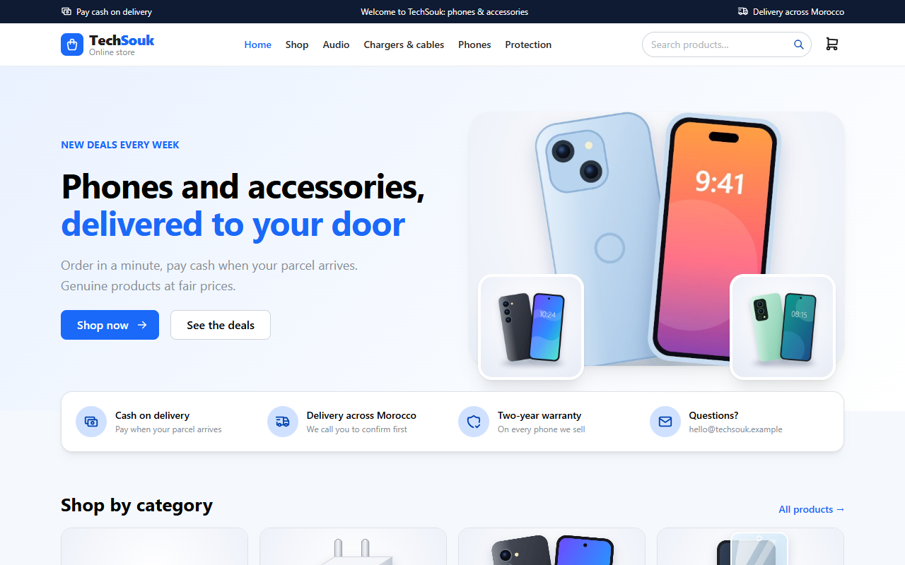
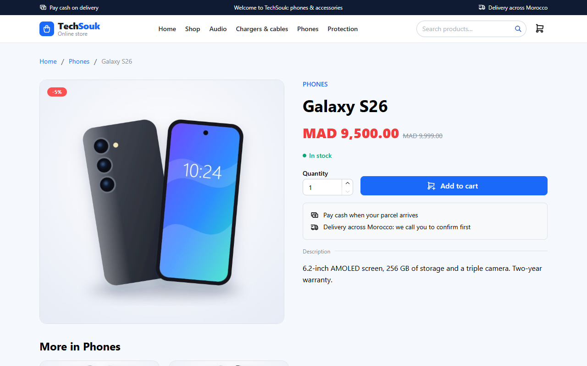
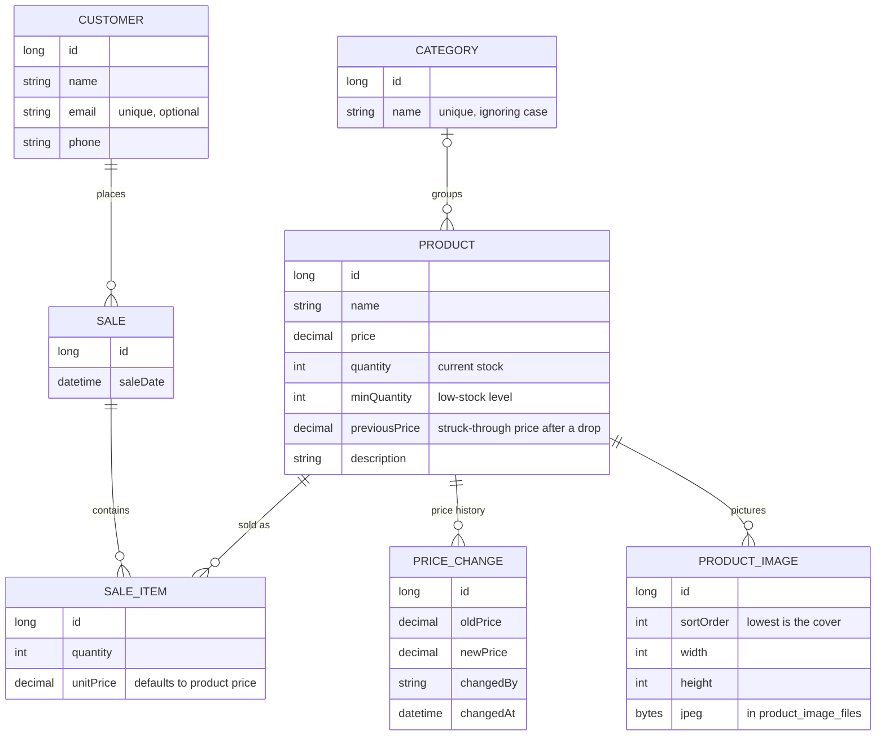

# TechSouk: online shop and back-office

[](https://github.com/IlyasRachid20/stock-api/actions/workflows/ci.yml)


A complete shop for **phones and accessories**: customers browse it on the **website**, staff sell at the **counter** and manage **products, stock and reports** in the **back-office**. Everything runs on one stock that can't be oversold, through a Java / Spring Boot API that answers every error with a clear message.

The repository is still called `stock-api`: the project started as the API behind the back-office.



| Product page | Back-office dashboard |
|---|---|
|  |  |
| **New sale at the counter** | **Stock history** |
|  |  |

## What I built, and why

A small shop needs to know three things at any moment: **what is in stock, what was sold, and why the numbers are what they are.** Spreadsheets get these wrong as soon as two people sell at the same time.

This project is a complete, production-style answer to that problem:

- **A Java / Spring Boot API** that keeps stock correct under concurrent sales (row locking, one transaction per sale), records every stock change with who made it and when, and exposes clear reports.
- **An online shop** where visitors browse categories, deals and best sellers, see honest availability ("only 2 left") and fill a cart kept in their browser, on the same stock as the counter.
- **A React back-office** that a cashier can use all day (new sale in a few clicks, live total, stock and customer search) and that gives the owner the numbers: revenue per day, best sellers, low stock, CSV export.
- **Security built in:** JWT login, hashed passwords, and roles that decide what each person can see and do (cashiers never see revenue).
- **Built to be maintained:** versioned database migrations, a clean API contract, consistent errors, Docker, and **292 automated tests** on every change, from unit tests up to a real browser making a sale in the running app.

Every feature was added through a reviewed pull request with its tests, and bugs found along the way (lost stock updates, N+1 queries, time-zone errors) are covered by tests so they can't come back.

## Highlights

- **Secure by default:** every endpoint needs a JWT from `POST /api/auth/login`; passwords are stored as BCrypt hashes; `ADMIN` and `CASHIER` roles.
- **Full stock history:** every change (initial stock, restock, correction, sale, cancelled sale) is recorded with the quantity before and after, who made it and when. When stock doesn't add up, the history shows why.
- **Low-stock alerts:** each product has a minimum level; `GET /api/products/low-stock` lists what needs reordering, emptiest first.
- **Categories:** products are filed in categories (Phones, Audio…), the product list filters by category, and the reports show the revenue of each category. A category can only be deleted once it's empty.
- **Price history and honest reductions:** every price change is recorded with who made it and when. After a price drop, the old price is shown struck through for 30 days, and it's the lowest price of the 30 days before the drop (the European rule), so raising a price just before a "promotion" can't fake a reduction.
- **Online orders, paid cash on delivery:** the checkout sends only product ids and quantities (prices always come from the database), the order takes its stock at once through the same locked sale engine as the counter, and the customer follows it with the order number and their phone. Delivery is free from MAD 500 (settings). Against fake orders: 5 orders an hour per connection, 3 orders waiting for confirmation per phone, and the exact stock is never revealed. An order only counts as revenue once delivered.
- **Orders handled by the staff:** the cashier calls to confirm, then ships; the order moves NEW → CONFIRMED → SHIPPED → DELIVERED and can't skip a step. Cancelling (before shipping) or a parcel refused at the door puts the products back in stock while the order and its lines stay, with who did what and why. The order row is locked during a change, so two clicks can't put the stock back twice. Orders nobody confirmed within 48 hours are cancelled automatically every hour, freeing their stock.
- **Public catalog for the online shop:** `/api/shop/...` needs no login and only shows published products, with "only 3 left" instead of the exact stock (no minimum levels, no price history). A product hidden from the shop is still sold at the counter.
- **Product pictures:** up to 6 per product, the first one is the cover. The browser shrinks a photo before sending it; the server checks it (size read from the header before decoding), shrinks it to 1200 px and saves it again as a JPEG, so hidden data such as a phone photo's GPS position is never kept. Pictures live in PostgreSQL (a free host's disk is wiped on restart) and are cached by browsers for a year.
- **Sales reports (admin):** totals, day-by-day sales with no gaps (ready for charts), best sellers, revenue by category and a CSV export, counted in the shop's own time zone.
- **Stock always in sync:** selling an item takes it out of stock; deleting an item or a whole sale puts it back.
- **No overselling, even under load:** the product row is locked while its stock changes (by a sale or a product update), so two requests at the same moment can't both take the last unit or overwrite each other's stock.
- **Fast lists:** related rows are loaded in batches, so a page of sales takes at most 5 queries instead of one per sale, item and product (41 before). A test fails if this regresses.
- **Standard HTTP semantics:** `201 Created` on create, `204 No Content` on delete.
- **Clear, consistent errors:** every error has the same JSON shape, including malformed JSON, wrong types, unknown URLs and wrong methods: `400` with a message per invalid field, `404` for unknown ids, `409` for business conflicts (not enough stock, email already used), and a generic `500` that never leaks internals.
- **Sales with totals:** each sale returns its items, line totals and a computed total. Sale dates are UTC instants (`...Z`), so clients in any time zone show the right local time.
- **Versioned database schema:** tables are created by Flyway migration scripts; Hibernate only validates them at startup and never changes the database.
- **Pagination, search and sorting** on every list, with a hard cap of 100 items per page.
- **Clean API contract:** requests and responses are dedicated DTOs (Java records), separate from the database entities, so internal fields never leak and the database can change without breaking clients.
- **Interactive documentation:** Swagger UI lists every endpoint and lets you try it from the browser.
- **227 backend tests, 54 frontend tests and 11 end-to-end tests** run on every pull request with GitHub Actions: the backend on H2 **and on a real PostgreSQL**, and the end-to-end tests in a **real Chrome** against the whole app running in Docker.

## Tech stack

| Layer | Technology |
|---|---|
| Language | Java 21 |
| Framework | Spring Boot 4.1 (Web MVC, Data JPA, Validation) |
| Database | PostgreSQL, schema managed by Flyway (H2 in-memory for fast tests) |
| API docs | springdoc-openapi 3 / Swagger UI |
| Tests | JUnit 5, MockMvc, AssertJ |
| CI | GitHub Actions: tests on H2 and PostgreSQL, plus a Docker Compose smoke test |
| Packaging | Docker multi-stage image (non-root), Docker Compose |
| Security | Spring Security 7, JWT (HS256) via the OAuth2 resource server, BCrypt |
| Build | Maven (wrapper included) |
| Web app (shop and back-office) | React 19, TypeScript, Vite, Mantine (UI and charts), TanStack Query, React Router |

## Data model



## API overview

| Resource | Endpoints |
|---|---|
| Customers | `GET/POST /api/customers` · `GET/PUT/DELETE /api/customers/{id}` |
| Products | `GET/POST /api/products` · `GET/PUT/DELETE /api/products/{id}` · `GET /api/products/low-stock` · `POST /api/products/{id}/restock` · `POST /api/products/{id}/adjustments` · `GET /api/products/{id}/price-history` |
| Pictures | `POST /api/products/{id}/images` (multipart, `file`) · `PUT /api/products/{id}/images/{imageId}/cover` · `DELETE /api/products/{id}/images/{imageId}` · `GET /api/images/{imageId}` (public JPEG) |
| Categories | `GET/POST /api/categories` (with the number of products in each) · `PUT/DELETE /api/categories/{id}` |
| Stock history | `GET /api/stock-movements?productId=&type=` (newest first) |
| Reports (`ADMIN` only) | `GET /api/reports/summary` · `GET /api/reports/sales-by-day` · `GET /api/reports/top-products` · `GET /api/reports/sales-by-category` · `GET /api/reports/sales.csv` (all take `from`/`to`, default the last 30 days) |
| Sales | `GET/POST /api/sales` · `GET/DELETE /api/sales/{id}` |
| Sale items | `GET/POST /api/sale-items` · `GET/DELETE /api/sale-items/{id}` |
| Online orders (staff) | `GET /api/orders?status=&search=` · `GET /api/orders/counts` · `GET /api/orders/{id}` · `POST /api/orders/{id}/status` |
| Online shop (public, no login) | `GET /api/shop/home` · `GET /api/shop/categories` · `GET /api/shop/products?category=&search=&ids=` · `GET /api/shop/products/{id}` · `GET /api/shop/info` (delivery fee) · `POST /api/shop/orders` · `POST /api/shop/orders/track` |
| Auth | `POST /api/auth/login` (public) · `GET /api/auth/me` |
| Users (`ADMIN` only) | `GET/POST /api/users` · `DELETE /api/users/{id}` |

Full details, request bodies and a **Try it out** button: http://localhost:8080/swagger-ui.html

### Authentication

```http
POST /api/auth/login
{"username": "admin", "password": "..."}
```
```json
{"accessToken": "eyJhbGciOiJIUzI1NiJ9...", "tokenType": "Bearer", "expiresIn": 28800}
```

Send the token on every other request as `Authorization: Bearer <accessToken>`. In Swagger UI, click **Authorize** and paste it. Without a valid token the API answers `401`; with a role that isn't allowed, `403`. The login endpoint ignores any token sent with it, so an expired token (for example one Swagger UI still remembers) never blocks logging in again.

On first start, when there are no users, an `admin` account is created with the password from `APP_ADMIN_PASSWORD`, or a generated one printed once in the logs. The admin then creates the other accounts with `POST /api/users`.

| Setting | Purpose |
|---|---|
| `APP_JWT_SECRET` | Signs the tokens, at least 32 bytes. If unset, a random key is used and tokens stop working after a restart (development only). |
| `APP_ADMIN_PASSWORD` | Password of the first `admin` account. |
| `APP_TIME_ZONE` | Shop time zone for reports, e.g. `Africa/Casablanca` (default `UTC`). |
| `APP_DELIVERY_FEE` / `APP_FREE_DELIVERY_FROM` | Online shop delivery fee and the order amount from which delivery is free, in MAD (default `30.00` and `500.00`). |

### Roles

| | `ADMIN` | `CASHIER` |
|---|---|---|
| Read products, customers, sales | yes | yes |
| Register and update customers | yes | yes |
| Create sales and add items | yes | yes |
| Create, update or delete products (prices, stock) | yes | no |
| Handle online orders (confirm, ship, deliver, cancel) | yes | yes |
| Read categories | yes | yes |
| Add or delete product pictures | yes | no |
| Create, rename or delete categories | yes | no |
| Restock, adjust stock | yes | no |
| Read stock history and low-stock list | yes | yes |
| Sales reports and CSV export | yes | no |
| Delete customers, sales or sale items | yes | no |
| Manage user accounts | yes | no |

Anything not listed as open to cashiers is admin-only by default, including endpoints added later.

### Lists: pagination, search and sorting

Every list endpoint is paginated (20 items per page by default, at most 100) and accepts `page`, `size` and `sort`:

| Endpoint | Filter |
|---|---|
| `GET /api/products` | `search`: part of the name, case-insensitive · `categoryId` |
| `GET /api/customers` | `search`: part of the name or email |
| `GET /api/sales` | `customerId` (newest sales first by default) |
| `GET /api/sale-items` | `saleId` |

```http
GET /api/products?search=galaxy&sort=price,desc&page=0&size=20
```
```json
{
  "content": [
    {"id": 1, "name": "Galaxy S26", "price": 9500.00, "quantity": 10}
  ],
  "page": {"size": 20, "number": 0, "totalElements": 1, "totalPages": 1}
}
```

### Example: selling a product

```http
POST /api/sales
{"customerId": 1, "items": [{"productId": 1, "quantity": 3}, {"productId": 6, "quantity": 2}]}
```

The sale and all its items are saved in **one transaction**: if any product is short of stock, nothing is saved and the API answers `409`. `unitPrice` is optional and defaults to the product's current price. Items can also be added one by one to an existing sale with `POST /api/sale-items` `{"saleId": 1, "productId": 1, "quantity": 3}`.

The product's stock goes from 10 to 7, and the sale now shows its total:

```http
GET /api/sales/1
```
```json
{
  "id": 1,
  "customer": {"id": 1, "name": "Ahmed"},
  "saleDate": "2026-09-29T17:11:37Z",
  "items": [
    {"id": 1, "saleId": 1, "product": {"id": 1, "name": "Galaxy S26"}, "quantity": 3, "unitPrice": 9500.00, "lineTotal": 28500.00}
  ],
  "total": 28500.00
}
```

### Stock history

```http
POST /api/products/1/restock        {"quantity": 20, "reason": "Delivery #42"}
POST /api/products/1/adjustments    {"quantityChange": -1, "reason": "Broken screen"}
GET  /api/stock-movements?productId=1
```
```json
{
  "content": [
    {"type": "ADJUSTMENT", "quantityChange": -1, "quantityAfter": 26, "reason": "Broken screen", "createdBy": "admin", "createdAt": "2026-09-29T22:20:00Z", ...},
    {"type": "RESTOCK", "quantityChange": 20, "quantityAfter": 27, "reason": "Delivery #42", "createdBy": "admin", ...},
    {"type": "SALE", "quantityChange": -3, "quantityAfter": 7, "reason": "Sale 12", "saleItemId": 31, "createdBy": "sara", ...}
  ],
  "page": {...}
}
```

Movement types: `INITIAL`, `RESTOCK`, `ADJUSTMENT`, `SALE`, `SALE_CANCELLED`. History rows are only ever added, never edited.

### Error responses

Every error uses one of two shapes: `{"error": "message"}`, or `{"errors": {"field": "message"}}` for invalid request bodies.

```http
POST /api/sale-items   (quantity 50, only 7 left)
409 Conflict
{"error": "Not enough stock for product 'Galaxy S26': 7 available, 50 requested"}

GET /api/products/abc
400 Bad Request
{"error": "Invalid value 'abc' for parameter 'id'"}

GET /api/products?sort=color
400 Bad Request
{"error": "Cannot sort by unknown field 'color'"}

POST /api/products     {"name": "", "price": -5}
400 Bad Request
{"errors": {"name": "must not be blank", "price": "must be greater than or equal to 0.00"}}
```

## Deploy your own (Render + Neon, free)

1. Create a PostgreSQL database on [Neon](https://neon.tech) and note its **direct** connection (not the `-pooler` one): host, database, user, password.
2. On [Render](https://render.com): **New → Blueprint**, pick this repository. [`render.yaml`](render.yaml) describes the service; Render asks for the database settings and an admin password, and generates `APP_JWT_SECRET` itself.
3. The first deploy creates the tables (Flyway), the `admin` account and, in demo mode, a sample shop with a `demo` cashier account.

The free plan sleeps after 15 minutes without traffic, so the first request after a pause can take about a minute.

## Getting started

### Option 1: Docker (recommended)

Only [Docker](https://www.docker.com/products/docker-desktop/) is needed: no Java, no PostgreSQL install.

```bash
git clone https://github.com/IlyasRachid20/stock-api.git
cd stock-api
cp .env.example .env        # then set the passwords and APP_JWT_SECRET in .env
docker compose up --build
```

Open **http://localhost:8080/admin** for the back-office, and http://localhost:8080/swagger-ui.html for the API documentation. The image builds the React dashboard and the API serves it from the same address, so there is nothing else to start. The database is kept in a Docker volume between restarts; `docker compose down --volumes` deletes it.

To try it with sample data (a month of sales and a `demo` cashier account with the password `demo-cashier`), set `APP_DEMO_DATA=true` and `APP_DEMO_PASSWORD=demo-cashier` in `.env` before the first start.

### Option 2: Run with Java

**Prerequisites:** JDK 21 and a running PostgreSQL database. No Maven install is needed: use `./mvnw` (or `mvnw.cmd` on Windows).

1. Clone the repository:
   ```bash
   git clone https://github.com/IlyasRachid20/stock-api.git
   cd stock-api
   ```
2. Point the app at your database with environment variables, so credentials never end up in Git:
   ```bash
   export SPRING_DATASOURCE_URL=jdbc:postgresql://localhost:5432/stock_api
   export SPRING_DATASOURCE_USERNAME=your_user
   export SPRING_DATASOURCE_PASSWORD=your_password
   ```
   On Windows PowerShell use `$env:SPRING_DATASOURCE_URL = "..."`. In an IDE, set them in the run configuration.
   The database must exist but can be empty: Flyway creates the tables on first start.
3. Start the app:
   ```bash
   ./mvnw spring-boot:run
   ```
4. Open http://localhost:8080/swagger-ui.html.

## Web app (React): online shop and back-office

The `frontend/` folder holds one React + TypeScript app with two parts.

**The online shop** at `/`, for everyone (no account):

- **Home:** categories with a picture, deals (recent price drops, struck through) and best sellers of the month.
- **Shop:** all products or one category, search, sorting by name, price or newest; everything is in the address (`/shop?category=phones&sort=price,asc`).
- **Product page** at a readable address (`/p/1-galaxy-s26`): pictures, price, availability ("only 2 left"), quantity, description, more products of the category.
- **Cart:** kept in the browser, checked against the latest prices and stock when it's opened; a product that left the shop is flagged. Shows the delivery fee and how much more makes delivery free.
- **Checkout:** name, phone, city, address, note; no account and no card: the customer pays cash on delivery. The confirmation page gives the order number.
- **Order tracking** (`/track`): order number + the phone used, then the order's steps (received, confirmed, on its way, delivered).

**The back-office** at `/admin`, for the staff (login):

- **Login** with the API's JWT; the session ends when the token expires.
- **Dashboard:** revenue, sales, items sold and average sale for 7, 30 or 90 days, a revenue-per-day chart, the online part of the revenue, best sellers, revenue by category, CSV export (admins), and the low-stock list (everyone).
- **New sale:** pick a customer, add products (with price and stock shown), adjust quantities, see the total, complete the sale in one request.
- **Sales:** list with totals, where each sale was made (counter or online, with the order's status), details of each sale, cancelling a counter sale puts its items back in stock (admins).
- **Online orders:** tabs by step (to confirm, confirmed, shipped, delivered, cancelled, returned) with counts, search by number, name or phone; each order shows the address, a phone link, the lines, the history (who, when, note) and buttons for the next steps. The menu shows how many orders wait for a call.
- **Products:** pictures, "Show in the online shop" switch, search, filter by category (kept in the address, so it can be bookmarked), pagination, badges, recent price drops struck through with the reduction (also in the new sale screen), price history; admins add pictures (shrunk in the browser first) and choose the cover; admins create, edit, restock, correct stock and delete.
- **Categories** (admins): add, rename and delete categories; each one links to its products.
- **Customers:** search, create and edit (everyone), delete (admins).
- **Stock history:** every stock change with who made it and when, filterable by type.
- **Users** (admins): create cashier or admin accounts, delete accounts.

What the interface shows depends on the role: cashiers don't see (or load) the revenue reports.

The back-office lives under `/admin` (`/admin/login`, `/admin/products`...); the root of the site is kept for the online shop. In production (Docker, Render) the API serves the built app from the same address: any page that isn't the API or a file returns the app, so links and refreshes on `/admin/sales/new` work.

For development, with the API running on port 8080:

```bash
cd frontend
npm install
npm run dev
```

Open http://localhost:5173/admin. Vite forwards `/api` to the API, so no CORS setup is needed. Checks: `npm run lint`, `npm run typecheck`, `npm test`, `npm run build`.

**End-to-end tests** (`frontend/e2e`, Playwright) drive a real browser through the whole app started with Docker Compose in demo mode: a visitor goes from a category to a product and fills a cart, a visitor orders with cash on delivery and tracks the order, a cashier confirms, ships and delivers an order and the customer sees each step, a product hidden by an admin leaves the shop, a cashier makes a sale and the stock goes down, a cashier can't see revenue or user management, an admin restocks a product, the demo products are filed in categories, recent price drops are struck through, demo pictures load and an admin adds and deletes one, pages survive a refresh and logout ends the session. They use the Chrome or Edge already installed:

```bash
BASE_URL=http://localhost:8080 E2E_BROWSER=msedge E2E_ADMIN_PASSWORD=... E2E_CASHIER_PASSWORD=... npm run e2e
```

## Tests

```bash
./mvnw test
```

Tests run against an in-memory H2 database, so they need no PostgreSQL and no credentials. In CI they also run against PostgreSQL 17, twice: on an empty database, and on one created before Flyway was added, to prove both upgrade paths. They cover the API end to end through MockMvc: validation, not-found and conflict errors, stock updates, sale totals, and the API documentation. The same suite runs on every pull request.

## Project structure

```
src/main/java/com/ilyas/stockapi
├── config/        OpenAPI (Swagger) setup
├── controller/    REST endpoints only: HTTP in, DTOs out, no business logic
├── dto/           Request and response records (the API contract)
├── entity/        JPA entities (database tables)
├── exception/     NotFound / Conflict / BadRequest, mapped to HTTP by the error handler
├── repository/    Spring Data JPA repositories
├── security/      Login, JWT signing and checking, access rules, first admin account
└── service/       Business rules and transactions (customers, products, sales and stock)

src/main/resources/db/migration
├── V1__create_tables.sql
├── V2__add_foreign_key_indexes.sql
├── V3__sale_date_with_time_zone.sql
├── V4__create_app_users.sql
└── V5__stock_movements_and_min_quantity.sql
```

## Roadmap

- [x] Request/response DTOs
- [x] Pagination and search
- [x] Flyway database migrations
- [x] Docker Compose
- [x] JWT authentication with `ADMIN` / `CASHIER` roles
- [x] Per-role access rules for products, customers and sales
- [x] Stock movement history and low-stock alerts
- [x] Sales reports and CSV export
- [ ] Live demo (deployment files ready: `render.yaml`)
- [x] Web dashboard (React)
- [x] Docker Compose with the dashboard
- [x] Product categories
- [x] Price history and struck-through old prices
- [x] Product pictures
- [x] Online shop: home, categories, product pages, cart
- [x] Online checkout with cash on delivery, order tracking
- [x] Orders in the back-office: confirm, ship, deliver, cancel, automatic cancellation after 48 hours
- [ ] Security: login attempt limit, access ends when a user is deleted, change password

## Author

**Ilyas Rachid** · [GitHub @IlyasRachid20](https://github.com/IlyasRachid20)
