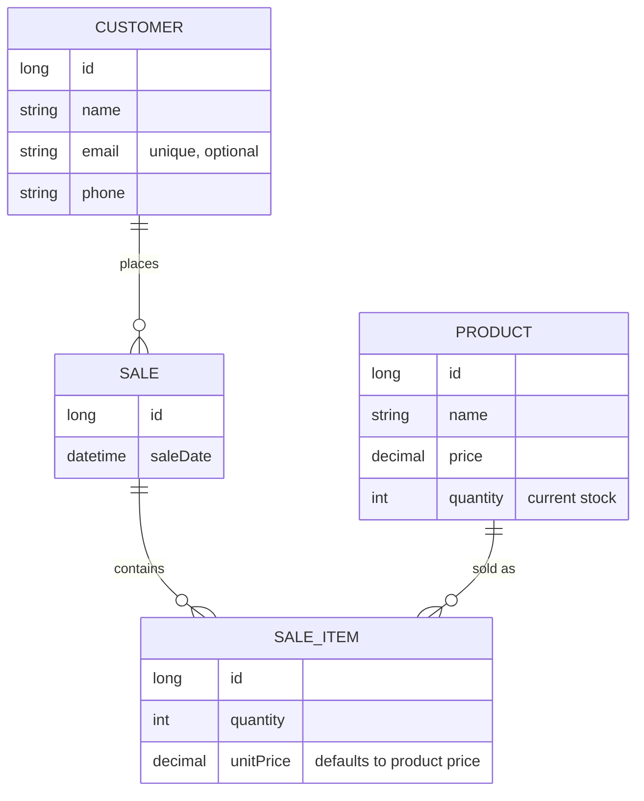

# Stock API

[](https://github.com/IlyasRachid20/stock-api/actions/workflows/ci.yml)


A REST API for small shops to manage **customers, products, sales and stock**.
Every sale updates the stock automatically, overselling is impossible, and every
error comes back with a clear message.

## Highlights

- **Stock always in sync:** selling an item takes it out of stock; deleting an item or a whole sale puts it back.
- **No overselling, even under load:** the product row is locked while its stock changes, so two sales at the same moment can't both take the last unit.
- **Clear errors:** `400` with a message per invalid field, `404` for unknown ids, `409` for business conflicts (not enough stock, email already used).
- **Sales with totals:** each sale returns its items and a computed total.
- **Pagination, search and sorting** on every list, with a hard cap of 100 items per page.
- **Clean API contract:** requests and responses are dedicated DTOs (Java records), separate from the database entities, so internal fields never leak and the database can change without breaking clients.
- **Interactive documentation:** Swagger UI lists every endpoint and lets you try it from the browser.
- **69 automated tests** run on every pull request with GitHub Actions.

## Tech stack

| Layer | Technology |
|---|---|
| Language | Java 21 |
| Framework | Spring Boot 4.1 (Web MVC, Data JPA, Validation) |
| Database | PostgreSQL (H2 in-memory for tests) |
| API docs | springdoc-openapi 3 / Swagger UI |
| Tests | JUnit 5, MockMvc, AssertJ |
| CI | GitHub Actions |
| Build | Maven (wrapper included) |

## Data model



## API overview

| Resource | Endpoints |
|---|---|
| Customers | `GET/POST /api/customers` · `GET/PUT/DELETE /api/customers/{id}` |
| Products | `GET/POST /api/products` · `GET/PUT/DELETE /api/products/{id}` |
| Sales | `GET/POST /api/sales` · `GET/DELETE /api/sales/{id}` |
| Sale items | `GET/POST /api/sale-items` · `GET/DELETE /api/sale-items/{id}` |

Full details, request bodies and a **Try it out** button: http://localhost:8080/swagger-ui.html

### Lists: pagination, search and sorting

Every list endpoint is paginated (20 items per page by default, at most 100) and accepts `page`, `size` and `sort`:

| Endpoint | Filter |
|---|---|
| `GET /api/products` | `search`: part of the name, case-insensitive |
| `GET /api/customers` | `search`: part of the name or email |
| `GET /api/sales` | `customerId` (newest sales first by default) |
| `GET /api/sale-items` | `saleId` |

```http
GET /api/products?search=galaxy&sort=price,desc&page=0&size=20
```
```json
{
  "content": [
    {"id": 1, "name": "Galaxy S26", "price": 9500.00, "quantity": 10}
  ],
  "page": {"size": 20, "number": 0, "totalElements": 1, "totalPages": 1}
}
```

### Example: selling a product

```http
POST /api/sales
{"customerId": 1}

POST /api/sale-items
{"saleId": 1, "productId": 1, "quantity": 3}
```

`unitPrice` is optional and defaults to the product's current price.

The product's stock goes from 10 to 7, and the sale now shows its total:

```http
GET /api/sales/1
```
```json
{
  "id": 1,
  "customer": {"id": 1, "name": "Ahmed"},
  "saleDate": "2026-09-29T17:11:37",
  "items": [
    {"id": 1, "saleId": 1, "product": {"id": 1, "name": "Galaxy S26"}, "quantity": 3, "unitPrice": 9500.00, "lineTotal": 28500.00}
  ],
  "total": 28500.00
}
```

### Error responses

```http
POST /api/sale-items   (quantity 50, only 7 left)
409 Conflict
{"error": "Not enough stock for product 'Galaxy S26': 7 available, 50 requested"}

GET /api/products?sort=color
400 Bad Request
{"error": "Cannot sort by unknown field 'color'"}

POST /api/products     {"name": "", "price": -5}
400 Bad Request
{"errors": {"name": "must not be blank", "price": "must be greater than or equal to 0.00"}}
```

## Getting started

**Prerequisites:** JDK 21 and a running PostgreSQL database. No Maven install is needed: use `./mvnw` (or `mvnw.cmd` on Windows).

1. Clone the repository:
   ```bash
   git clone https://github.com/IlyasRachid20/stock-api.git
   cd stock-api
   ```
2. Point the app at your database with environment variables, so credentials never end up in Git:
   ```bash
   export SPRING_DATASOURCE_URL=jdbc:postgresql://localhost:5432/stock_api
   export SPRING_DATASOURCE_USERNAME=your_user
   export SPRING_DATASOURCE_PASSWORD=your_password
   ```
   On Windows PowerShell use `$env:SPRING_DATASOURCE_URL = "..."`. In an IDE, set them in the run configuration.
3. Start the app:
   ```bash
   ./mvnw spring-boot:run
   ```
4. Open http://localhost:8080/swagger-ui.html.

## Tests

```bash
./mvnw test
```

Tests run against an in-memory H2 database, so they need no PostgreSQL and no credentials. They cover the API end to end through MockMvc: validation, not-found and conflict errors, stock updates, sale totals, and the API documentation. The same suite runs on every pull request.

## Project structure

```
src/main/java/com/ilyas/stockapi
├── config/        OpenAPI (Swagger) setup
├── controller/    REST endpoints and the shared error handler
├── dto/           Request and response records (the API contract)
├── entity/        JPA entities (database tables)
├── repository/    Spring Data JPA repositories
└── service/       SaleService: sales and stock in one transaction
```

## Roadmap

- [x] Request/response DTOs
- [x] Pagination and search
- [ ] Flyway database migrations and Docker Compose
- [ ] JWT authentication with `ADMIN` / `CASHIER` roles
- [ ] Stock movement history and low-stock alerts
- [ ] Sales reports and CSV/PDF export
- [ ] Live demo
- [ ] Web dashboard

## Author

**Ilyas Rachid** · [GitHub @IlyasRachid20](https://github.com/IlyasRachid20)
